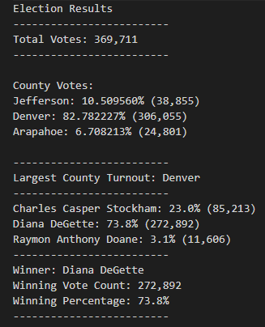

# Election-Analysis
Modeul 3 election analysis

## Overview of Election Audit
  For this module I was given the task of reviewing a lump sum set of data from a recent election. With that I was to find the outcome of not just the winner but of each candidates total votes, along with data for each county and how many votes came from them. 

## Election-Audit Results
  -Total votes: 369,711
  -Percentage totals for votes divided by county:
  Below I have put a snippet of code explaing how I found county totals and the percentage of votes per county. 
  
          # 3: Extract the county name from each row.
        county_name = row[1]    
         # 4a: Write an if statement that checks that the
        # county does not match any existing county in the county list.
        if county_name not in county_list:
            # 4b: Add the existing county to the list of counties.
            county_list.append(county_name)
            # 4c: Begin tracking the county's vote count.
            county_votes[county_name] = 0
        # 5: Add a vote to that county's vote count.
        county_votes[county_name] += 1
      
  -The county that had the largest total nmber of votes was Denver with 366,055 votes.
  -Next task was to breakdown the total amount of votes for each candidate and make it easy to read with indentations, headings, and spaces. 
  
  
  
  
  
 - The candidate that won the election was Diana Degette with 272,892 votes and A total vote percentage of 73.8%.
  
## Election-Audit Summary
  All in all I believe that this script I have provided for the election is very flexible and with slight modification to the code can be used for any election weather it be small and local or state wide similar to what I have done with this. A couple examples I can give include creating something simple like A list. Lists are easily changed and convenient to have. Second I believe that the "county_votes[county_name]" for example you can swap almost anything weather it be A candidates name or A state/county. 
